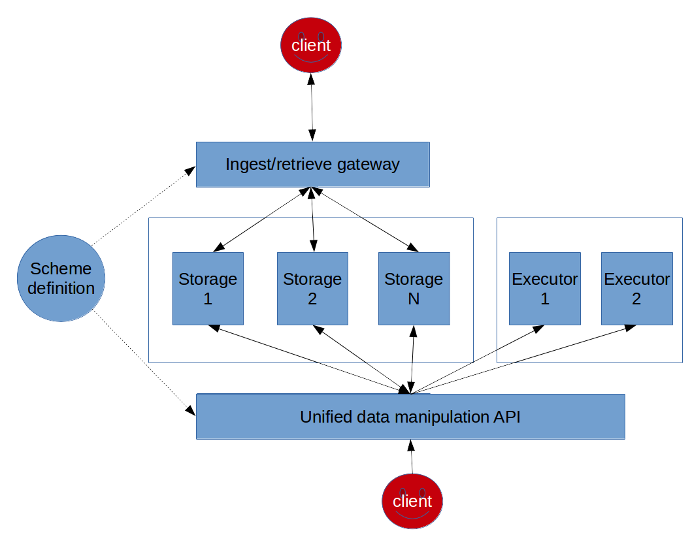

[](https://travis-ci.org/datadrivencz/proxima-platform)
[](https://sonarcloud.io/dashboard?id=cz.o2.proxima%3Aplatform-parent)
[](http://search.maven.org/#search|gav|1|g:"cz.o2.proxima")

# The Proxima platform

The platform is a generic data ingestion, manipulation and retrieval framework.
High level can be described by following scheme:



## Design document
High level design document can be found [here](https://docs.google.com/document/d/1s6UFrEaFldjuGhLX9IosTnfNcMhMpvGjCWfI_5Lqqp4/edit?usp=sharing).

## Scheme definition
First, let's introduce some glossary:
 * _entity_: a named dictionary consisting of string **key** and one or more _attributes_
 * _attribute_: an atomic field of entity with string **name** and **scheme** definining its data-type
 * _attribute family_: a logical grouping of attributes of the same entity into a named group
 * _storage_: a physical store for data

 ### Example scheme definition
 The scheme definition uses [HOCON](https://github.com/typesafehub/config/blob/master/HOCON.md).
 As a short example we will show definition of data processing of a hypothetic e-commerce site. The site has some goods,
 some users and generates some events which describe how users interact with the goods. We will use
 [protocol buffers](https://developers.google.com/protocol-buffers/) for serialization.

 First, let's define our data model. We will model the system which processes events coming from some source in given
 format and based on these events creates a model of user preferences.
 ```
 entities {
   # user entity, let's make this really simple
   user {
     attributes {

       # some details of user - e.g. name, email, ...
       details { scheme: "proto:cz.o2.proxima.example.Example.UserDetails" }

       # model of preferences based on events
       preferences { scheme: "proto:cz.o2.proxima.example.Example.UserPreferences" }

       # selected events are stored to user's history
       "event.*" { scheme: "proto:cz.o2.proxima.example.Example.BaseEvent" }

     }
   }
   # entity describing a single good we want to sell
   product {
     # note: we have to split to separate attributes each attribute that we want to be able
     # to update *independently*
     attributes {

       # price, with some possible additional information, like VAT and other stuff
       price { scheme: "proto:cz.o2.proxima.example.Example.Price" }

       # some general details of the product
       details { scheme: "proto:cz.o2.proxima.example.Example.ProductDetails" }

       # list of associated categories
       "category.*" { scheme: "proto:cz.o2.proxima.example.Example.ProductCategory" }

     }
   }

   # the events which link users to goods
   event {
     attributes {

       # the event is atomic entity with just a single attribute
       data { scheme: "proto:cz.o2.proxima.example.Example.BaseEvent" }

     }
   }

 }
 ```
 Next, after defining our data model, we need to specify attribute families for our entities. This definition
 is highly dependent on the **access pattern** to the data. Mostly, we have to worry about how are we going to
 read our data. Relevant questions are:
  * are we going to need a random access (get or list request) for data by entity key and attribute name?
  * are we going to be reading the data as continuously updated stream?
  * do we want to be able to read all historical updates, or are we interested only in the last updated value for each attribute?
  * are we going to process the data in batch fashion to build some sort of model?

 Let's describe our intentions as follows:
  * we need to be able to batch reprocess all events (maybe limited by some global time window, say two years back), in order to build a model that will be used to update user's preferences with incoming events
  * we need random acccess to data stored per user and per product
  * we need access to stream of events to be able to do real-time updates to user preferences
  * we want to be able to select some events to be stored in user's history and then list this history by time from newest to oldest

  To be able to fulfill these requirements, we have chosen the following storages:
   * [Apache Kafka](https://kafka.apache.org/) (for streaming)
   * [Apache Cassandra](http://cassandra.apache.org/) (for random access to data)
   * [Apache Hadoop HDFS](https://hadoop.apache.org/docs/r1.2.1/hdfs_design.html) (for batch procesing)

   This will yield us the following setup for attribute families (some details are ommitted for simplicity):
   ```
    attributeFamilies {

       # we need this to be able to read user attributes 'details' and 'preferences' by user's key
       user-random-access {
         entity: user
         attributes: [ "details", "preferences" ]
         storage: "cassandra://"${cassandra.seed}/${cassandra.user-table}"?primary=user"
         type: primary
         access: random-access
       }

       # store incoming events to user's history
       user-event-history-store {
         entity: event
         attributes: [ "data" ]
         storage: "cassandra://"${cassandra.seed}/${cassandra.user-event-table}/
         # this class defines how we transform incoming event to CQL
         cqlFactory: cz.o2.proxima.example.EventHistoryCqlFactory
         # this is filtering condition, we want to select only some events
         filter: cz.o2.proxima.example.EventHistoryFilter
         type: replica
         access: write-only
       }

       # this family defines read access to the stored event history
       user-event-history-read {
         entity: user
         attributes: [ "event.*" ]
         storage: "cassandra://"${cassandra.seed}/${cassandra.user-event-table}"?primary=user&secondary=stamp&data=event&reversed=true"
         # ignore this for now
         converter: cz.o2.proxima.storage.cassandra.DateToLongConverter
         type: replica
         # we will not explicitly modify this, it will be updated automatically by incoming events
         access: read-only
       }

       # random access to products
       product-random-acesss {
         entity: product
         attributes: [ "*" ]
         storage: "cassandra://"${cassandra.seed}/${cassandra.product-table}
         type: primary
         access: random-access
       }

       # event stream storage
       event-commit-log {
         entity: event
         attributes: [ "*" ]
         storage: "kafka://"${kafka.brokers}/${kafka.events-topic}
         # this is our commit log
         type: primary
         access: commit-log
       }
       # store events for batch analytics
       event-batch-storage {
         entity: event
         attributes: [ "*" ]
         storage: "hdfs://"${hdfs.authority}/${hdfs.event-path}
         type: replica
         access: batch-updates
       }

     }

     cassandra {
       seed = "cassandra:9042"
       user-table = "user"
       product-table = "product"
       user-event-table = "user_event"
     }

     kafka {
       brokers = "kafka1:9092,kafka2:9092,kafka3:9092"
       events-topic = "events"
     }

     hdfs {
       authority = "hdfs-master"
       event-path = "/events"
     }

   ```
   By this definition, we have (somewhat simplified) working description of Proxima platform scheme for data manipulation,
   that can be fed into the ingestion/retrieval service and will start working as described above.

 ## Platform's data model
 Generally, data are modelled as unbounded stream of _updates_ to attributes of entities. Each update consists of the following:
  * name of entity
  * name of attribute
  * value of attribute (or flag representing _delete_)
  * timestamp of the update
  * UUID of the update

 Each stream can then be represented as a _table_ (a.k.a [table-stream duality](https://docs.confluent.io/current/streams/concepts.html#duality-of-streams-and-tables)), which is essentially a snapshot of a stream at a certain time (in terms of Proxima platform called _batch snapshot_).

 ## Compiling scheme definition to access classes
 The platform contains maven compiler of scheme specification to java access classes as follows:
 ```xml
      <plugin>
        <groupId>cz.o2.proxima</groupId>
        <artifactId>compiler-maven-plugin</artifactId>
        <version>0.5.0</version>
        <configuration>
          <outputDir>${project.build.directory}/generated-sources/model</outputDir>
          <javaPackage>cz.o2.proxima.testing.model</javaPackage>
          <className>Model</className>
          <config>${basedir}/src/main/resources/test-readme.conf</config>
        </configuration>
        <executions>
          <execution>
            <phase>generate-sources</phase>
            <goals>
              <goal>compile</goal>
            </goals>
          </execution>
        </executions>
        <dependencies>
          <!--
            Use direct data operator access, see later
          -->
          <dependency>
            <groupId>${project.groupId}</groupId>
            <artifactId>proxima-direct-compiler-plugin</artifactId>
            <version>0.5.0</version>
          </dependency>
          <!--
            The following dependencies define additional
            dependencies for this example
          -->
          <dependency>
            <groupId>${project.groupId}</groupId>
            <artifactId>proxima-core</artifactId>
            <version>${project.version}</version>
            <classifier>tests</classifier>
          </dependency>
          <dependency>
            <groupId>${project.groupId}</groupId>
            <artifactId>proxima-scheme-proto</artifactId>
            <version>0.5.0</version>
          </dependency>
          <dependency>
            <groupId>${project.groupId}</groupId>
            <artifactId>proxima-scheme-proto</artifactId>
            <version>0.5.0</version>
            <classifier>tests</classifier>
          </dependency>
        </dependencies>
      </plugin>
 ```

 This plugin then generates class `cz.o2.proxima.testing.model.Model` into `target/generated-sources/model`.
 The class can be instantiated via
 ```java
   Model model = Model.of(ConfigFactory.defaultApplication());
  ```
  or (in case of tests, where some validations and initializations are skipped)
  ```
   Model model = Model.ofTest(ConfigFactory.defaultApplication());
  ```

 ## Platform's _DataOperators_
 The platform offers various modes of access to data. As of version 0.4.x, these types are:
  * direct
  * Apache Beam
 ### Direct access to data
 This operator is used when accessing data from inside single JVM (or potentially multiple JVMs, e.g. coordinated via distributed consumption of commit log). The operator is constructed as follows:
 ```java
    private DirectDataOperator createDataOperator(Model model) {
      Repository repo = model.getRepo();
      return repo.getOrCreateOperator(DirectDataOperator.class);
    }
 ```
 Next, we can use the operator to create instances of data accessors, namely:
  * CommitLogReader
  * BatchLogObserver
  * RandomAccessReader

 For instance, observing commit log can be done by
 ```java
    DirectDataOperator operator = model.getRepo().getOrCreateOperator(DirectDataOperator.class);
    CommitLogReader commitLog = operator.getCommitLogReader(
        model.getEvent().getDataDescriptor())
        .orElseThrow(() -> new IllegalArgumentException("Missing commit log for "
            + model.getEvent().getDataDescriptor()));
    commitLog.observe("MyObservationProcess", new LogObserver() {

      @Override
      public boolean onError(Throwable error) {
        throw new RuntimeException(error);
      }

      @Override
      public boolean onNext(StreamElement elem, OnNextContext context) {
        log.info("Consumed element {}", elem);
        // commit processing, so that it is not redelivered
        context.confirm();
        // continue processing
        return true;
      }

    });
 ```
 Creating BatchLogReader or RandomAccessReader is analogous.

 ### [Apache Beam](https://beam.apache.org/) access to data
 First, create BeamDataOperator as follows:
 ```java
   BeamDataOperator operator = model.getRepo().getOrCreateOperator(BeamDataOperator.class);
 ```
 Next, use this operator to create PCollection from Model.
 ```java
   // some import omitted, including these for clarity
   import org.apache.beam.sdk.extensions.euphoria.core.client.operator.CountByKey;
   import org.apache.beam.sdk.transforms.windowing.AfterWatermark;
   import org.apache.beam.sdk.transforms.windowing.FixedWindows;
   import org.apache.beam.sdk.values.KV;
   import org.apache.beam.sdk.values.PCollection;
   import org.apache.beam.sdk.values.WindowingStrategy.AccumulationMode;

   Pipeline pipeline = Pipeline.create();
   PCollection<StreamElement> input = operator.getStream(
       pipeline, Position.OLDEST, false, true,
       model.getEvent().getDataDescriptor());
   PCollection<KV<String, Long>> counted = CountByKey.of(input)
       .keyBy(el -> model.getEvent()
           .getDataDescriptor()
           .valueOf(el)
           .map(BaseEvent::getProductId)
           .orElse(""))
       .windowBy(FixedWindows.of(Duration.standardMinutes(1)))
       .triggeredBy(AfterWatermark.pastEndOfWindow())
       .accumulationMode(AccumulationMode.DISCARDING_FIRED_PANES)
       .output();
   // do something with the output
 ```
